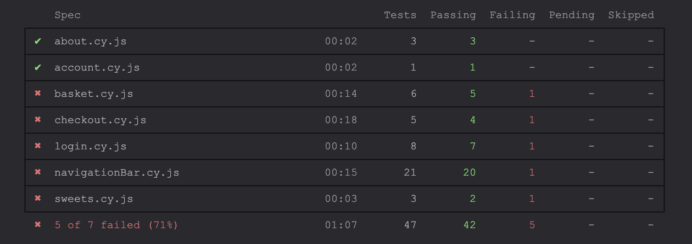

# 🍬 Sweet Shop - Cypress Test Automation


  
Automated end-to-end testing for the **Sweet Shop** web application using **Cypress**.

🛒 **Live App**: [**Sweet Shop**](https://sweetshop.netlify.app)

---

## 📝 Description

The project includes automated Cypress tests that verify the core functionalities of the **Header (navigation bar)**, **Sweets**, **About**, **Login**, **Account**, and **Basket** pages.

These features are thoroughly tested using:
- **7 Test Scenarios (TS)**
- **47 Test Cases (TC)**

All TSs and TCs are described in the [**TestCases.md**](/TestCases.md) file. 

To enhance test efficiency, the project utilizes Cypress commands and custom helper functions.

The project also incorporates a robust CI/CD pipeline using GitHub Actions. 

Additionally, the identified functional test cases have been registered as Tasks in Jira. Relevant information can be found in the [**JiraProject/JiraSummary.md**](/JiraProject/JiraSummary.md) file.

---
## 🔖 Table of Contents

- [Description](#-description)
- [Folder Structure](#-folder-structure)
- [Installation](#-installation)
- [Running Cypress Tests](#-running-cypress-tests)
- [Cypress Commands](#-cypress-commands)
- [CI/CD with GitHub Actions](#-cicd-with-github-actions)
- [Screenshot of Testing Results](#-screenshot-of-testing-results)
- [License](#-license)
- [Author](#-author)


---
## 🔁 Folder Structure

The Cypress test suite is organized within the [**cypress/e2e/**](cypress/e2e/) directory, where each TS has its corresponding TCs contained in separate spec files. 

<pre> SWEETSHOP_PROJECT 
├── .github/ 
│ └── workflows/ # GitHub Actions workflow for CI 
├── cypress/ 
│ ├── e2e/ # End-to-end test specs 
│ │ ├── about.cy.js 
│ │ ├── account.cy.js 
│ │ ├── basket.cy.js 
│ │ ├── checkout.cy.js 
│ │ ├── login.cy.js 
│ │ ├── navigationBar.cy.js 
│ │ └── sweets.cy.js 
│ ├── fixtures/ # Test data (example.json) 
│ ├── reports/ # Test reports 
│ ├── screenshots/ # Failure screenshots 
│ ├── support/ # Custom Cypress commands 
│ │ └── commands.js 
│ └── e2e.js # Cypress setup 
├── JiraProject/ # Jira-related documentation 
├── node_modules/ # Dependencies 
├── .gitignore # Git ignore file 
├── cypress.config.js # Cypress configuration 
├── package.json # Dependencies & scripts 
├── package-lock.json # Dependency lockfile 
└── TestCases.md # Test cases documentation </pre>

---
## 🔧 Installation
### 1️⃣ Prerequisites

Node.js  
npm 

### 2️⃣ Clone the Repository

```
git clone https://github.com/AukseMaz/Sweetshop_Project.git
```
### 3️⃣ Install Dependencies
```
npm install
```
---

## 🧪 Running Cypress Tests  
In this project, the [**package.json**](/package.json) contains scripts designed to simplify the execution of Cypress tests, offering two distinct modes:  
### Run Cypress in UI Mode
```
npm run cy:open
```
### Run Cypress in CLI Mode
```
npm run cy:run
```
---

## ⚙️ Cypress Commands

The project leverages **hooks** and **helper functions** to streamline the Cypress testing process. All relevant information can be found in the [**cypress/support/commands.js**](/cypress/support/commands.js) file. 
| Command                          | Purpose                       |
|----------------------------------|-------------------------------|
| `cy.visitMainPage()`             | Visit main page                |
| `cy.visitSweetsPage()`           | Visit sweets page          |
| `cy.visitAboutPage()`            | Visit about page              |
| `cy.visitLoginPage()`            | Visit login page                   |
| `cy.visitBasketPage()`           | Visit basket page                  |
| `cy.addRandomItemsToBasket(min, max)` | Add random number of sweets |
| `cy.fillCheckoutForm(...)`      | Fill out the entire checkout form |

---

## 🚀 CI/CD with GitHub Actions
The workflow is triggered on push and pull requests to the main branch.   
The GitHub Actions workflow [**.github/workflows/cypress.yml**](.github/workflows/cypress.yml) performs the following steps:

- Checks out the repository using actions/checkout@v4.
- Installs dependencies using npm install.
- Sets up Node.js version 18.
- Runs Cypress tests for end-to-end testing.
- Executes Cypress tests using cypress-io/github-action@v6. 

---

## 🖼️ Screenshot of Testing Results  


---

## 📄 License
ISC

---

## 🧑‍💻 Author
Auksė Mažeikienė

